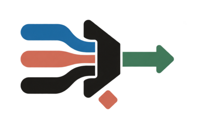
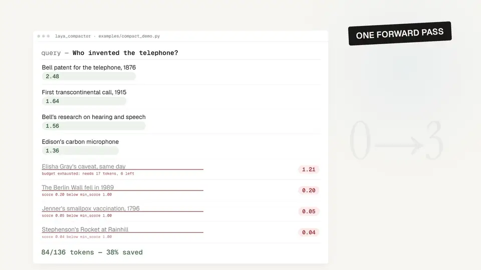
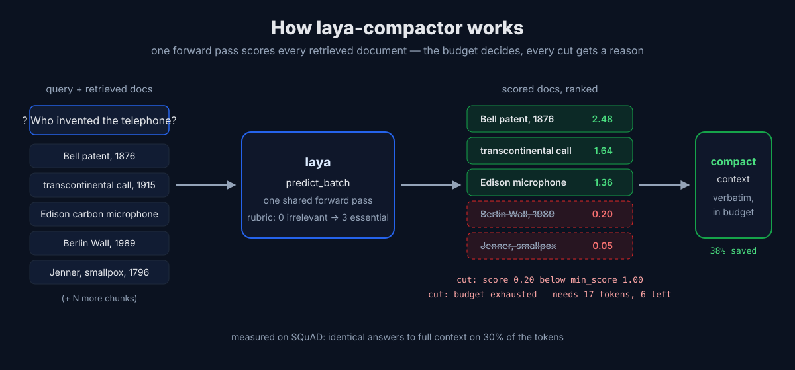
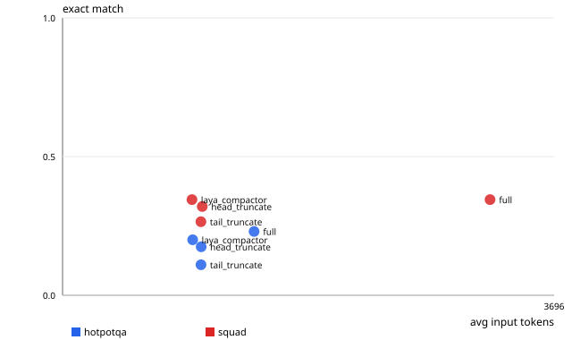

<div align="center">

<picture>
  <source media="(prefers-color-scheme: dark)" srcset="docs/logo-dark.png">
  <source media="(prefers-color-scheme: light)" srcset="docs/logo.png">
  
</picture>

# laya-compactor

<p><strong>Keep the evidence. Cut the noise.</strong></p>

Query-aware context compaction for RAG and agents. Score an entire retrieval
batch in one local forward pass, then keep only the documents worth sending to
your LLM.

[](https://github.com/Gjusev/laya-compactor/actions/workflows/ci.yml)
[](https://www.python.org/)
[](https://github.com/Gjusev/laya-compactor)
[](LICENSE)
[](#status-and-limitations)

[Quick start](#quick-start) · [How it works](#how-it-works) ·
[Benchmarks](#measured-results) · [Integrations](#integrations) ·
[Limitations](#status-and-limitations)

</div>

<a href="docs/launch/brag.mp4">
  
</a>

<p align="center">
  <a href="docs/launch/brag.mp4"><strong>▶ Watch the 18-second demo with sound</strong></a>
  · H.264 MP4 · 1080p
</p>

> **Measured on SQuAD:** the same exact-match score as full context with **973
> average input tokens instead of 3,214**. On HotpotQA, it retained **94.5% of
> answer-bearing documents** while using 32% fewer input tokens than full
> context. [See the full methodology and tradeoffs.](#measured-results)

## Why laya-compactor?

RAG pipelines often retrieve more text than the final model needs. Sending all
of it raises token cost and can bury the useful evidence; truncating from the
head or tail ignores the query.

laya-compactor makes the cut deliberately:

- **Query-aware:** each document is scored against the question that triggered
  retrieval.
- **One shared forward pass:** the whole batch is scored with laya's
  `predict_batch`, rather than one model request per document.
- **Local after download:** scoring runs with the open-source
  [laya](https://github.com/NandhaKishorM/laya) checkpoint; there is no
  per-compaction API call.
- **Verbatim output:** documents are either kept whole or removed. Their text is
  never rewritten or summarized.
- **Auditable cuts:** every removed document includes its score and a concrete
  reason, such as a low relevance score or an exhausted token budget.

The project is in early development and publishes its losses alongside its
wins. Read [Status and limitations](#status-and-limitations) before using it in
a production path.

## Quick start

Install from the repository with Python 3.10 or newer:

```bash
git clone https://github.com/Gjusev/laya-compactor.git
cd laya-compactor
uv venv
uv pip install -e .
```

Compact a retrieval batch to a token budget:

```python
from laya_compactor import compact

query = "Who designed the Eiffel Tower?"
retrieved_docs = [
    "Gustave Eiffel's company designed and built the Eiffel Tower.",
    "The tower was completed in Paris in 1889.",
    "The Berlin Wall fell in 1989.",
]

result = compact(query, retrieved_docs, budget=20)

result.kept   # ScoredDoc objects, most relevant first, text unchanged
result.cut    # CutDoc objects with a human-readable reason
result.stats  # token counts, kept/cut totals and savings percentage
```

The first run downloads the laya checkpoint from Hugging Face; later runs use
the local cache. If the budget must match a provider exactly, pass that
provider's tokenizer through `token_counter`. The dependency-free default is a
deterministic word-count proxy.

<details>
<summary><strong>Use the command line</strong></summary>

```bash
laya-compact \
  --budget 4000 \
  --query "Who designed the Eiffel Tower?" \
  docs.jsonl
```

`docs.jsonl` contains one document per line, either as plain text or as a JSON
object with a `"text"` field. The command prints JSON with the kept documents,
the cut documents and token statistics.

Useful options:

```text
--min-score FLOAT
--rubric default|v2_question_first|v3_needle
```

</details>

## How it works



1. **Score the batch.** Each `(query, document)` pair receives a continuous
   score against a four-level rubric: `0` irrelevant, `1` background, `2`
   relevant and `3` essential. All pairs share one `predict_batch` call.
2. **Rank by relevance.** Documents are ordered from highest to lowest score;
   equal scores preserve the original retrieval order.
3. **Apply the policy.** Documents below `min_score` are removed first. The
   remaining documents are kept verbatim until the token budget is full.
4. **Explain every cut.** The result records whether each document was removed
   because of its score or because it no longer fit the budget.

```text
retrieved docs + query
          │
          ▼
  one predict_batch call
          │
          ▼
 relevance-ranked docs ──► min_score ──► token budget
          │                                  │
          └──────── kept verbatim ◄──────────┘
                                             └── cut + reason
```

`compact()` also accepts an injected `agent`, any object exposing
`predict_batch(states, questions)`, plus a custom `token_counter` and rubric
variant. This keeps the selection logic testable without loading the real
checkpoint.

## Measured results



The reported evaluation runs 200 questions from each dataset with the same
BM25 retrieval, generator, judge, prompts and 1,000-token budget for all three
budgeted policies. **Full** is the unbudgeted reference. The generator and judge
were `glm-5.3-flash` through Z.ai's OpenAI-compatible API at temperature 0.

| Dataset | What the result says |
| --- | --- |
| **SQuAD · single-hop** | laya-compactor matched full context at **0.345 exact match** with **973 vs 3,214 average input tokens**. |
| **HotpotQA · multi-hop** | It reached **0.200 vs 0.230 exact match**, retained **94.5% of gold documents**, and used **979 vs 1,440 average input tokens**. |
| **Against truncation** | At the same budget, laya-compactor beat both head and tail truncation on exact match and gold-document retention for HotpotQA. |

<details>
<summary><strong>Full benchmark tables</strong></summary>

### HotpotQA

| Metric | full | head | tail | **laya-compactor** |
| --- | ---: | ---: | ---: | ---: |
| Average input tokens | 1,440 | 1,042 | 1,041 | **979** |
| Exact match | **0.230** | 0.175 | 0.110 | 0.200 |
| LLM-judge win rate vs full | reference | 0.431 | 0.350 | **0.495** |
| Gold documents kept | **100%** | 87.5% | 58.8% | 94.5% |
| Cost / 1,000 questions, credits | 4.31 | 3.62 | 4.27 | **3.45** |
| Compaction latency p50 | — | — | — | 6.3 s |

### SQuAD

| Metric | full | head | tail | **laya-compactor** |
| --- | ---: | ---: | ---: | ---: |
| Average input tokens | 3,214 | 1,050 | 1,040 | **973** |
| Exact match | **0.345** | 0.320 | 0.265 | **0.345** |
| LLM-judge win rate vs full | reference | 0.440 | 0.385 | **0.480** |
| Gold documents kept | **73.5%** | 59.0% | 49.5% | 65.5% |
| Cost / 1,000 questions, credits | 8.00 | 3.07 | 3.04 | **2.83** |
| Compaction latency p50 | — | — | — | 10.0 s |

Seven of 1,600 generation calls and seven judge calls failed with provider 4xx
responses. They remain recorded in `eval/results/rows.jsonl` rather than being
silently removed. Costs use the supplied Z.ai GLM-5.3-Flash credit multipliers:
2.3 input and 8 output credits per million tokens.

</details>

The multi-hop result is the important warning: deleting context can remove a
bridge document even when it looks secondary in isolation. laya-compactor kept
more answer-bearing documents than either truncation baseline, but it still
lost three exact-match points against full context on HotpotQA.

### Reproduce the evaluation

```bash
make smoke  # 3 questions per dataset, no LLM calls
make eval   # 200 questions per dataset; requires OPENAI_API_KEY
```

`OPENAI_BASE_URL` can point the harness at another OpenAI-compatible provider.
The full run writes `rows.jsonl`, `summary.json` and `table.md` under
`eval/results/`. Metrics include exact match, judge win rate, gold-document
retention, token counts, p50 compaction latency and computed cost.

The datasets are HotpotQA distractor validation for multi-hop retrieval and
SQuAD validation for single-hop retrieval. Subsets use a fixed seed with a
streaming shuffle; pin the `datasets` package version for bit-exact reruns.

## Integrations

<table>
  <tr>
    <td align="center" width="33%">
      <br>
      <strong>Python</strong><br>
      Core API and JSONL CLI
    </td>
    <td align="center" width="33%">
      <br>
      <strong>LangChain</strong><br>
      Query-aware document compressor
    </td>
    <td align="center" width="33%">
      <br>
      <strong>LlamaIndex</strong><br>
      Node postprocessor
    </td>
  </tr>
</table>

Install the optional integration dependencies:

```bash
uv pip install -e ".[integrations]"
```

<details open>
<summary><strong>LangChain</strong></summary>

```python
from langchain.retrievers import ContextualCompressionRetriever
from laya_compactor.integrations.langchain import LayaCompactor

retriever = ContextualCompressionRetriever(
    base_retriever=your_retriever,
    base_compressor=LayaCompactor(budget=1500),
)

results = retriever.invoke("Who designed the Eiffel Tower?")
# Kept Documents include their score in metadata["laya_score"].
```

</details>

<details>
<summary><strong>LlamaIndex</strong></summary>

```python
from laya_compactor.integrations.llamaindex import LayaCompactorPostprocessor

query_engine = index.as_query_engine(
    node_postprocessors=[LayaCompactorPostprocessor(budget=1500)],
)
```

</details>

Both wrappers accept the core options: `budget`, `min_score`, `agent` and
`token_counter`. Surviving items remain unchanged and are returned in relevance
order.

## Rubric sensitivity

Relevance models react to wording, so the repository ships three rubric
phrasings and a [100-row, hand-labeled mini-dataset](src/laya_compactor/data/relevance_mini_dataset.jsonl).
Each row contains a query, document, gold label from 0 to 3 and rationale.

Measured with the default English laya checkpoint on CPU:

| Metric | default | v2_question_first | v3_needle |
| --- | ---: | ---: | ---: |
| Agreement with gold labels | **0.68** | 0.53 | **0.68** |
| Mean absolute error | 0.43 | 0.47 | **0.42** |
| Mean score spread across variants | 0.24 | — | — |
| Rows where all variants round to the same level | 62% | — | — |

The default remains the default because the question-first phrasing lost 15
percentage points of label agreement on the same data. Re-run the study on the
packaged dataset or your own JSONL file:

```bash
python -m laya_compactor.sensitivity
python -m laya_compactor.sensitivity my_rows.jsonl
```

The raw checked-in report is at
[`eval/sensitivity_report.json`](eval/sensitivity_report.json).

## Status and limitations

- **Early development:** the public API and rubric variants may still change.
- **Token counts are configurable:** the library default uses a word-count
  proxy. The benchmark uses `tiktoken` with `cl100k_base` for every policy, so
  the comparison is consistent even though a provider's exact count may differ.
- **CPU latency is material:** measured p50 compaction time was 6.3 seconds on
  HotpotQA and 10.0 seconds on SQuAD on the evaluation desktop. Hardware and
  batch shape affect this substantially.
- **Scores are estimates:** a document cut at 0.9 may still matter. Tune
  `min_score` for the cost of a false negative in your application.
- **English first:** v0.1 uses laya's default English checkpoint.
- **Multi-hop remains hard:** isolated relevance scoring can undervalue bridge
  documents. The HotpotQA benchmark measures that failure mode explicitly.

## Development

```bash
uv venv
uv pip install -e ".[dev]"
pytest          # fast, offline unit tests; laya is mocked
pytest -m slow  # opt in to loading the real checkpoint
```

Useful project resources:

- [`examples/compact_demo.py`](examples/compact_demo.py) — runnable eight-document demo.
- [`docs/how-it-works-animation.html`](docs/how-it-works-animation.html) — dependency-free animated explainer.
- [`docs/comparison-fast-jev.md`](docs/comparison-fast-jev.md) — architectural comparison with `fast-jev-compaction`.
- [`docs/eval-summary.svg`](docs/eval-summary.svg) — visual benchmark summary used above.
- [`docs/social-preview.png`](docs/social-preview.png) — repository social preview artwork.

The project follows the same **delete, do not rewrite** principle as
[fast-jev-compaction](https://github.com/tamaratran/fast-jev-compaction), but
targets a different unit of work: retrieved documents instead of agent
transcripts. laya-compactor is built on the Apache-2.0-licensed
[laya decision engine](https://github.com/NandhaKishorM/laya).

## License

Apache 2.0. See [LICENSE](LICENSE).
